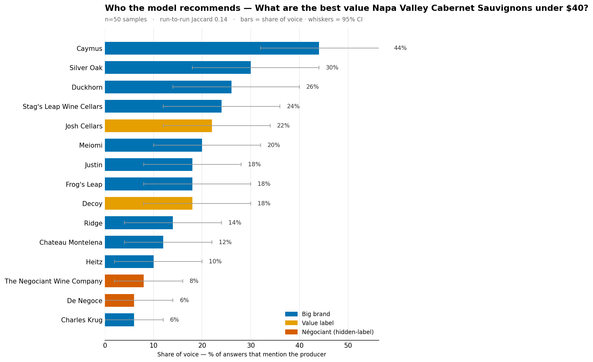
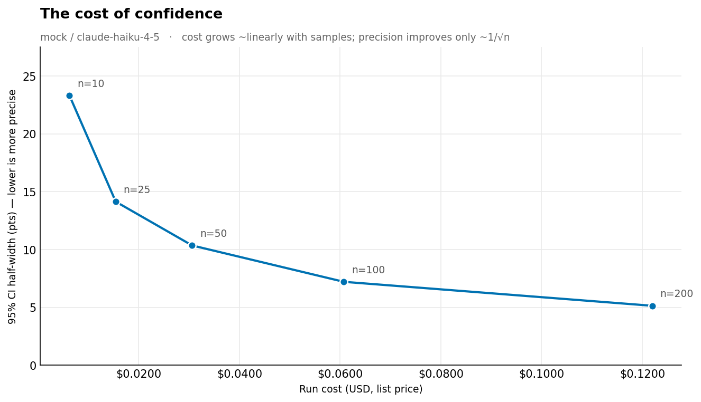

# wine-geo-monitor

[](https://github.com/tittle-xyz/wine-geo-monitor/actions/workflows/ci.yml)
[](LICENSE)

A tiny **Generative Engine Optimization (GEO)** monitor, pointed at wine.

When someone asks an AI assistant *"best value Napa Cabernet under $40,"* which
producers does it recommend — and how much does that answer change if you ask
again? This tool samples an LLM many times per question, measures each producer's
**share-of-voice**, and reports the two things a single answer hides: **how noisy
the measurement is** (a bootstrap confidence interval) and **how unstable it is
run-to-run** (mean pairwise Jaccard overlap of the recommended set).

It's a companion to a separate `wine-research` agent: that tool points *me* at the
models to source wine; this one measures *what the models say* about wine brands. Wine is the example because I can judge whether the recommendations are
any good (WSET Level 2) — the ground-truth check a GEO score ultimately needs.



*Ask the model for "best value Napa Cabernet under $40" fifty times and count who
gets named: the famous marketing brands (blue) dominate, while the négociant
hidden-label wines that are arguably the actual value play (orange accent) sit at
the bottom. Whiskers are 95% confidence intervals — note how many overlap, i.e.
how many ranking differences are inside the noise floor.*

> 🧭 **New to the code?** [`docs/TOUR.md`](docs/TOUR.md) walks one full run through the
> codebase, file by file — the fastest way to get oriented.

## Why it's built this way

- **Runs with no API key.** The default `mock` provider mimics a stochastic model,
  so `pytest` and a full run work offline. Real `anthropic` / `openai` providers
  sit behind the same `Provider` interface — a working miniature of the
  multi-provider abstraction layer a GEO monitor needs to survive one vendor
  repricing or retiring a model.
- **Treats every call as paid, rate-limited, and flaky.** The runner caps
  concurrency and retries with exponential backoff + jitter, and tracks token cost
  per run — because at real scale (brands × prompts × samples × surfaces × daily),
  inference cost *is* the gross margin.
- **Stats over point estimates.** Share-of-voice comes with a 95% CI and a
  run-to-run Jaccard, so you can see when two brands' apparent ranking gap is
  inside the noise floor.
- **CI gates on agent-readiness.** The pipeline runs
  [`toaster-ready`](https://github.com/tittle-xyz/toaster-ready) (`toaster gate`) to
  keep the repo easy for a human — or an agent — to ramp up on.

## It's a pipeline, not a script

The work splits into stages with a durable layer between each — the seam is data
at rest, not a function call:

```
collect  ─►  raw_samples   the immutable, PAID layer (one model response per row)
extract  ─►  mentions      which producers each sample named  (re-derivable)
aggregate ─► metrics       share-of-voice + CI + instability  (re-derivable)
```

Why this shape: the collector is dumb (it only captures raw responses), so the
expensive step — the API calls — runs once, and every downstream step re-runs for
**free** against the stored raw layer. Improve the brand matching, add sentiment,
fix a bug: reprocess `raw_samples`, spend nothing new. The raw layer is also the
audit trail — every metric is a re-derivable function of the actual responses, so
"why did my score change last Tuesday?" is answerable.

Stage logic lives in `wine_geo/pipeline.py` as plain functions. The CLI and the
Dagster assets are both thin wrappers over it.

## Run it (no orchestrator)

```bash
# no dependencies, no API key — runs the three stages in-process and reports:
python -m wine_geo --provider mock --n 30 --seed 42

# also write the three-layer artifacts to disk, and a chart:
pip install -e ".[viz]"
python -m wine_geo --provider mock --n 30 --seed 42 --out-dir out/ \
    --chart out/chart.png --chart-prompt p0

# against a real model (needs the extra + an API key):
pip install -e ".[anthropic]"
export ANTHROPIC_API_KEY=...
python -m wine_geo --provider anthropic --model claude-haiku-4-5 --n 20
```

## Run it as a Dagster DAG

The same stages, wrapped as a **daily-partitioned** asset graph
(`raw_samples → mentions → metrics → share_of_voice_chart`, plus a `cost` asset off
`raw_samples`) with a daily schedule, in `wine_geo/definitions.py`. Each day is its
own immutable slice you can backfill and re-run independently — the real shape of
GEO measurement (≥7–8 samples/day, aggregated over a rolling multi-week window).
`metrics` renders a share table right in the Dagster UI, `cost` reports the day's
token spend, and `share_of_voice_chart` emits the PNG per partition.

```bash
pip install -e ".[dagster,viz]"
dagster dev                    # UI at localhost:3000 — materialize / backfill
# or headless, one day:
dagster asset materialize -m wine_geo.definitions --select "*" --partition 2026-07-05
```

## Tests

```bash
pip install -e ".[dev]"
pytest
```

## What you'll see

Per prompt: producers ranked by share-of-voice, each with a 95% CI and a
distribution bar, plus the run-to-run Jaccard. The interesting finding the mock
reproduces (and real models tend to confirm): AI shopping answers **cluster on a
handful of famous, marketing-heavy brands**, and value / négociant labels barely
surface — which is exactly the visibility gap a GEO product sells against.

## The cost of confidence

Because every answer is a fresh sample, the honest question isn't *"what's the
share of voice"* — it's *"how many samples do I need to trust the number, and what
does that cost?"* The `cost` stage turns the token counts already on each
`RawSample` into spend, and a sweep across sample sizes makes the trade-off
visible:



On the mock run above, going from **10 → 200 samples per prompt** tightens the 95%
CI from ±22 pts to ±5 pts — **~4.5× more precise for ~20× the cost.** That's not a
surprise, it's the √n law: spend grows linearly with samples while precision
improves only as 1/√n (√20 ≈ 4.5). So there's a sweet spot, and past it you pay a
lot for a little confidence — exactly the lever a monitoring product tunes to
protect its margins. Regenerate it with `make cost-curve`; the same numbers land as
a daily-partitioned `cost` asset in the Dagster DAG.

## Layout

| File | Role |
|---|---|
| `wine_geo/pipeline.py` | the stages as plain functions (collect / extract / aggregate / cost) |
| `wine_geo/schema.py` | data contracts (`RawSample`, `Mention`) + JSONL I/O |
| `wine_geo/definitions.py` | Dagster assets (daily-partitioned), job, and schedule |
| `wine_geo/viz.py` | share-of-voice chart + cost-of-confidence curve (matplotlib, Okabe-Ito palette) |
| `wine_geo/providers.py` | `Provider` interface + mock / Anthropic / OpenAI, pricing table |
| `wine_geo/runner.py` | concurrent sampling, rate limit, retry/backoff |
| `wine_geo/extract.py` | producer mention detection (alias matching) |
| `wine_geo/stats.py` | share-of-voice, bootstrap CI, pairwise Jaccard |
| `wine_geo/report.py` | terminal report |
| `wine_geo/data/producers.json` | tracked producers + aliases |

## Honest limitations (a.k.a. the roadmap)

- Mention extraction is naive string matching — it can't handle paraphrase or a
  brand it doesn't know. A production version escalates ambiguous answers to a
  cheap model doing structured extraction (the model-tiering cost lever).
- One measurement is a snapshot; real monitoring aggregates over a rolling window.
- No sentiment yet — and sentiment is far less stable than mere presence, so it
  needs even more samples to measure honestly.
